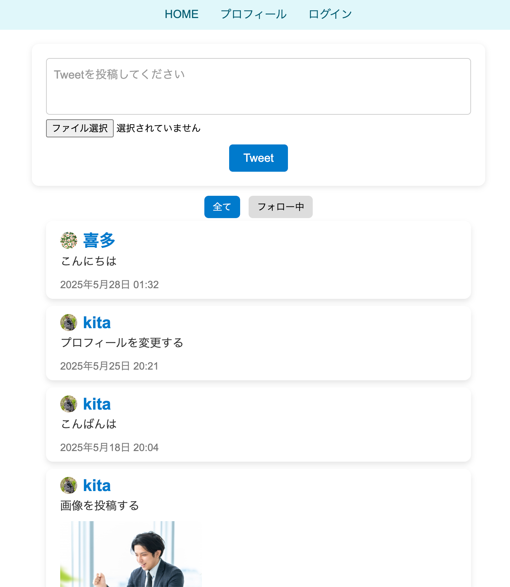
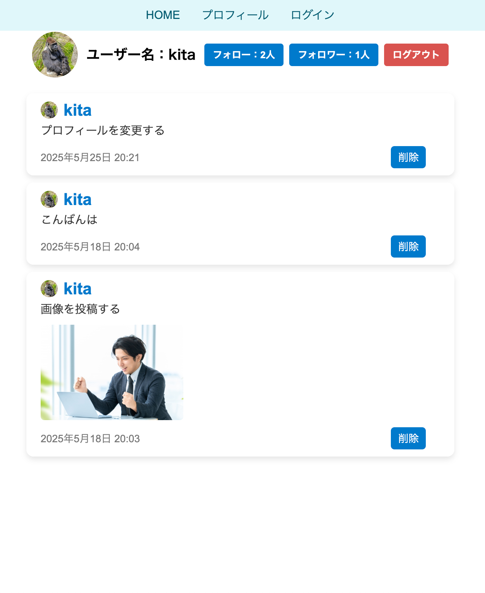

# Bocchi the Twitter

Twitter風SNSアプリケーション

クラウド環境にデプロイ済み[(URLはこちら)](https://client-bocchi-the-twitter.vercel.app/)

デプロイ環境
- フロントエンド：Vercel（https://vercel.com）
- バックエンド：Render（https://render.com）
- DB：Aiven（https://aiven.io）

## プロジェクト構成

このプロジェクトは以下の3つのサブプロジェクトで構成されています：

1. **client-bocchi-the-twitter** (フロントエンド)
   - Vue.js 3
   - Vue Router
   - Composition API
   - Pinia (状態管理)

2. **api-bocchi-the-twitter** (バックエンド)
   - Spring Boot
   - Spring Security
   - Spring Data JPA

3. **db-bocchi-the-twitter** (データベースマイグレーション)
   - Liquibase
   - MySQL

## セットアップ
詳細なセットアップはサブプロジェクトそれぞれの`README.md`を参照してください

### 前提条件

- Node.js 16以上
- Java 17以上
- MySQL 8.0以上

### データベースのセットアップ

1. データベースプロパティ

```properties
url=jdbc:mysql://localhost:50000/bocchi_the_twitter
username=root
password=password
```
2. データベースを作成
```sql
CREATE DATABASE bocchi_the_twitter;
```
3. マイグレーションの実行
```bash
cd db-bocchi-the-twitter
./gradlew update
```

### バックエンドのセットアップ

```bash
cd api-bocchi-the-twitter
./mvnw spring-boot:run
```

- アクセスURL: http://localhost:8080

### フロントエンドのセットアップ

```bash
cd client-bocchi-the-twitter
npm install
npm run serve
```

- アクセスURL: http://localhost:8081

使用されるプロパティファイル:

上記のコマンド（`npm run serve`）を実行すると、`.env.development` の内容が自動的に読み込まれます。
APIの接続先（VUE_APP_API_HOST_URL）やMSW（モック）の有効化設定などは、このファイルで定義されています。


## 認証機能

- ユーザー登録
- ログイン/ログアウト
- Cookieベースのセッション管理
- OIDC ログイン（Google）


## セキュリティ機能

- CORS設定
- パスワードのハッシュ化（BCrypt）


### AWS EC2へのデプロイ

1. EC2インスタンスの作成
2. MySQLのセットアップ
```bash
./setup-mysql-ec2.sh
```
3. アプリケーションのデプロイ
```bash
./bocchi-the-twitter.service
```


## スクリーンショット




